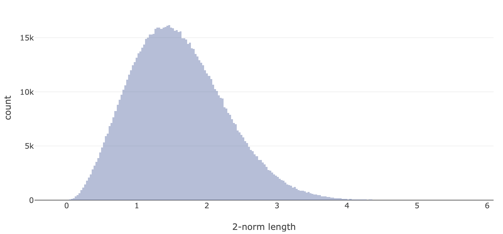

[//]: # (Formula can be generated at:
[//]: #   https://latex.codecogs.com/svg.image?latex_math_mode_code
[//]: # 
[//]: # Images can be included like this:
[//]: #   
[//]: # 
[//]: # Visuals in the local director can be included like this:
[//]: #   <p class="visual">
[//]: #   <iframe src="./local-file.html">
[//]: #   </iframe>
[//]: #   </p>
[//]: #   <p class="caption">Caption under the visual.</p>
[//]: # 
[//]: # Everything else follows normal markdown syntax.


# Data Distributions and Initializing Neural Networks

<p class="caption">
  <a href="https://www.reddit.com/r/MachineLearning/comments/tcott9/d_is_it_possible_for_us_to_make_fixedsize/">Comment and discuss this post on Reddit!</a>
  <br><a href="https://github.com/tchlux/tchlux.github.io/blob/master/research/2022-03_nn_svd/index.md?plain=1">Raise any issues on GitHub.</a>
  <br><a href="https://github.com/tchlux/tchlux.github.io/blob/master/research/2022-03_nn_svd/run.py">Run this code for yourself.</a>
</p>


*Is it possible for us to make fixed-size multilayer perceptrons (MLP's) provably converge?* This is the question I've been exploring for a while. It's always bothered me that initialization seems arbitrary and all the optimization algorithms produce different results that are "better for `X` domain" or "optimal for `N` or bigger data". The first step to really studying this phenomenon is to actually look at some data and see what is happening.

Let's consider a simple `MLP` that looks like:

```python
# Configure the model.
input_dim = 3
output_dim = 1
state_dim = 40
num_states = 10

# Initialize the weights (input, internal, output).
weight_matrices = [normal(input_dim, state_dim)] + \
                  [normal(state_dim, state_dim)
                   for i in range(num_states-1)] + \
                  [np.zeros((state_dim, output_dim))]
shift_vectors = [np.linspace(-1, 1, state_dim) for i in range(num_states)]

# Define the "forward" function for the model that makes predictions.
# Optionally provided "states" matrix that has a shape:
#   (num_states, x.shape[0], state_dim)
def forward(x, states=None):
    for i in range(num_states):
        x = np.clip(np.matmul(x, weight_matrices[i]) + shift_vectors[i],
            0.0, float("inf"))
        if (states is not None):
            states[i,:,:] = x[:,:]
    return np.matmul(x, weight_matrices[-1])
```

Given this simple ReLU architecture, lets define some random uniform
data ([over the unit
ball](https://stackoverflow.com/questions/54544971/how-to-generate-uniform-random-points-inside-d-dimension-ball-sphere/54544972#54544972))
and construct a test function for us to approximate. We'll use this to
observe some properties of the model.

```python
# Define some random data.
x = ball(100, input_dim)
y = np.cos(np.linalg.norm(x, axis=1, keepdims=True))

# Initialize holder for the states.
states = np.zeros((num_states, x.shape[0], state_dim))
# Initial evaluation of model at all data points.
forward(x, states=states)
```

Now we've got the internal representations of the data at every layer
of the network. From here we can look at their distributions to see
where we are losing (or gaining) information. Here's a visual of the
sample points that we've generated:

<p class="visual">
  <video controls="" autoplay="" loop="" type="video/mp4" src="./input_data.mp4"></video>  
</p>
<p class="caption">Data distribution at input, before passing through the model. Interact with this visual <a href="./input_data.html">here</a>.</p>

What about if we look at the representations that are created for data
inside the model? The internal dimension is too high to visualize, but
we can just look at the [principal
components](https://setosa.io/ev/principal-component-analysis/) to get
an idea for how the data is being transformed.

```python
# Use "sklearn" to compute the principal compoents and project data down.
def project(x, dimension):
    from sklearn.decomposition import PCA
    pca = PCA(n_components=dimension)
    pca.fit(x)
    return np.matmul(x, pca.components_.T)
```

Below are visuals of the data for layers 1, 6 (middle), and 10 (last).

<p class="visual">
  <video controls="" autoplay="" loop="" type="video/mp4" src="./normal_init/data_layer_1.mp4"></video>  
</p>
<p class="caption">Data distribution at the first layer of the model. Interact with this visual <a href="./normal_init/data_layer_1.html">here</a>.</p>

<p class="visual">
  <video controls="" autoplay="" loop="" type="video/mp4" src="./normal_init/data_layer_6.mp4"></video>  
</p>
<p class="caption">Data distribution at the middle layer of the model. Interact with this visual <a href="./normal_init/data_layer_6.html">here</a>.</p>

<p class="visual">
  <video controls="" autoplay="" loop="" type="video/mp4" src="./normal_init/data_layer_10.mp4"></video>  
</p>
<p class="caption">Data distribution at the last layer of the model. Interact with this visual <a href="./normal_init/data_layer_10.html">here</a>.</p>


The first thing to notice is that the scale of the data becomes huge!
This is exactly the problem that schemes like [Kaiming
initialization](https://arxiv.org/abs/1502.01852) try to solve. Random
normal weight initializations create vectors that rescale your
data. This is actually the distribution of 2-norm magnitudes for
weights that have been initialized with values from a purely random
normal distribution:

<p class="caption">
  
  2-norm distribution of random normal weight vectors. Notice that most of them are greater than 1, which means on average these vectors will increase the scale of data. Interact with this visual <a href="./normal_init/lengths.html">here</a>.
</p>

A simple way to try and solve that problem is to initialize
weight vectors inside the network to have unit 2-norm (this stops them
from scaling the data up or down, only doing directional projections).
This is what happens when we try to do that.

## Using random <code>sphere</code> initializations instead of <code>normal</code>

<p class="visual">
  <video controls="" autoplay="" loop="" type="video/mp4" src="./sphere_init/data_layer_1.mp4"></video>  
</p>
<p class="caption">Data distribution at the first layer of the model. Interact with this visual <a href="./sphere_init/data_layer_1.html">here</a>.</p>

<p class="visual">
  <video controls="" autoplay="" loop="" type="video/mp4" src="./sphere_init/data_layer_6.mp4"></video>  
</p>
<p class="caption">Data distribution at the middle layer of the model. Interact with this visual <a href="./sphere_init/data_layer_6.html">here</a>.</p>

<p class="visual">
  <video controls="" autoplay="" loop="" type="video/mp4" src="./sphere_init/data_layer_10.mp4"></video>  
</p>
<p class="caption">Data distribution at the last layer of the model. Interact with this visual <a href="./sphere_init/data_layer_10.html">here</a>.</p>


The scaling problem is mostly gone, if anything it's been reversed
(over many trials it balances closer to 1 though). Now the remaining
issue is how distorted the data has become. Notice that our data that
was nicely distributed over the unit ball has been pushed into a
slightly flat and arc-like pattern (i.e., we've lost a lot of input
direction variance). With this low dimensional input data, the
distortions are not much of an issue, but when we have data that has
high intrinsic dimension (≥ 10 nonzero principal components), then we
can quickly lose important information!


## Chasing the distributions

Lastly, let's try to generalize what we're observing. To do this we
can plot the distribution of singular values (roughly the amount
variance in data along the principal components) at each of the
internal state representations for the model when we raise the input
dimension to 40 (the same as the state dimensions).

<p class="visual">
  <video controls="" autoplay="" loop="" type="video/mp4" src="./sphere_init/singular_values.mp4"></video>  
</p>
<p class="caption">Singular value distribution at various layers in the model (plotting software bug causes some series to not correctly disappear on transitions). Interact with this visual <a href="./sphere_init/singular_values.html">here</a>.</p>

This is where the bulk of difficulties with initialization
lie. Whether it's different weight initializations, introducing
[residual connections](https://arxiv.org/abs/1512.03385), applying a
[layer-norm](https://arxiv.org/abs/1607.06450) operations, or
"training" your model (initializing) with a [forward gradient
method](https://arxiv.org/abs/2202.08587), we need to do something to
prevent this critical loss of variance during network initialization!

### We need to prevent total information loss at initialization.

Why? Because the gradient depends on the presence of information. We
cannot train a model with gradient descent when there is no gradient.
This is where I believe some of the most important fundamental
theoretical research in neural networks exists. We need a way to
**guarantee** we've solved this problem (the set of failure must have
a measure of 0) if we truly want to *solve* the neural network
training problem everywhere.
